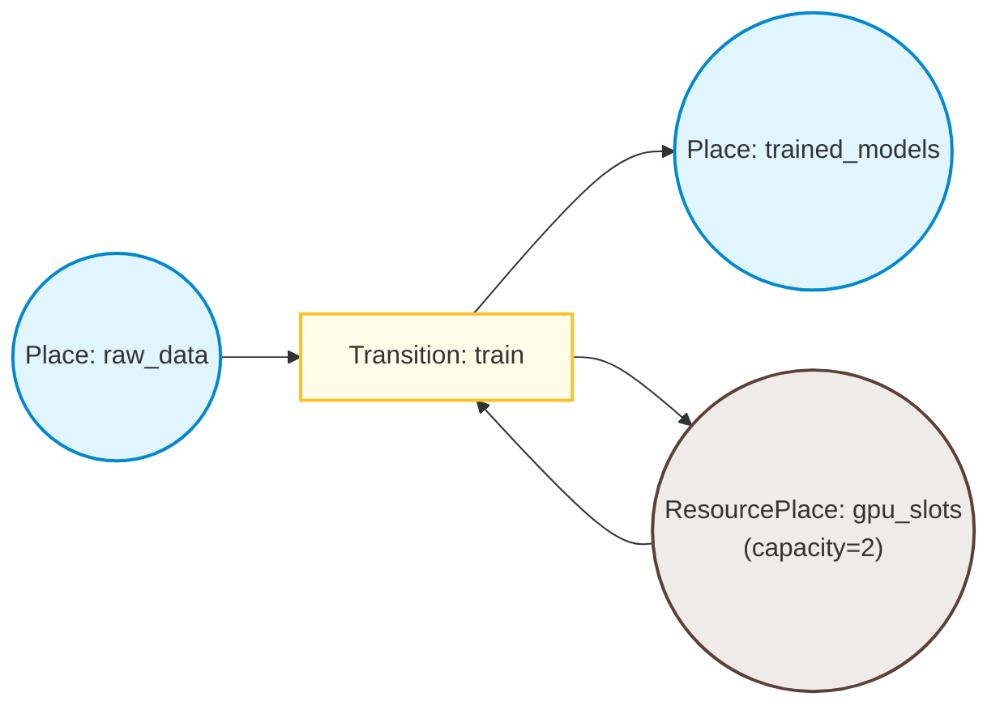

# cpnx

[](https://pypi.org/project/cpnx/)
[](https://pypi.org/project/cpnx/)
[](https://github.com/philgresh/cpnx/actions)
[](https://opensource.org/licenses/MIT)

**cpnx** is a Coloured Petri Net (CPN) executor for concurrent Python pipelines — zero dependencies, stdlib-only threading.

---

## Motivation

Python has excellent Petri net modeling libraries (like [SNAKES](https://snakes.ibisc.univ-evry.fr/) for formal analysis and [pm4py](https://pm4py.fit.fraunhofer.de/) for process mining) but lacks a lightweight concurrent runtime executor. Developers managing resource-constrained workflows (GPU slots, API rate limits, database connection pools) often stitch together `threading.Semaphore`, `ThreadPoolExecutor`, and `queue.Queue` by hand — ad-hoc wiring that is hard to visualise and impossible to formally reason about.

**cpnx** fills this gap: it models your concurrent pipeline as a Coloured Petri Net where transitions execute real work on thread pools, resource tokens are returned atomically on failure, and the net's structure makes resource contention a mathematical property rather than scattered locking code.

The execution model is aligned with Jensen's CPN formalism (see [Theoretical Foundation](#theoretical-foundation)), so the net you write is also amenable to formal analysis with standard CPN tools.

---

## Install

```bash
pip install cpnx
```

---

## Quickstart

A pool of 2 GPU slots shared across 10 concurrent training jobs:

```python
"""examples/gpu_pipeline.py — GPU slot management with cpnx."""

import time
from cpnx import InputArc, OutputArc, PetriNet, Place, ResourcePlace, Token, Transition


def train_model(tokens: list[Token]) -> list[Token]:
    data = tokens[0]
    time.sleep(0.5)  # simulate GPU work
    # Tokens are immutable — produce a new one with updated payload
    return [data.evolve(payload_updates={"trained": True})]


net = PetriNet(max_workers=4)

net.add_place(Place("raw_data"))
net.add_place(Place("trained_models"))
net.add_place(ResourcePlace("gpu_slots", capacity=2))

net.add_transition(Transition(
    name="train",
    inputs=[InputArc("raw_data"), InputArc("gpu_slots")],
    outputs=[OutputArc("trained_models"), OutputArc("gpu_slots")],
    action=train_model,
))

for i in range(10):
    net.deposit("raw_data", Token(payload={"model_id": i}))

net.run(deadline=time.monotonic() + 30)

print(f"Trained:            {len(net.places['trained_models'].tokens)}")
print(f"GPU slots returned: {len(net.places['gpu_slots'].tokens)}")
# Trained:            10
# GPU slots returned: 2
```

---

## Core Concepts

A CPN consists of **places** (token containers), **transitions** (processing steps), and **arcs** (directed connections). Tokens carry a **colour** that determines which places they may occupy and which transitions may consume them.



### Tokens

Tokens are **immutable**. Their `payload` is a [`FrozenDict`](#frozendict) — a hashable, recursively-immutable mapping. To produce a token with updated data, use `token.evolve()`:

```python
result = token.evolve(payload_updates={"score": 0.92})
```

Each token carries a `color: str | None` field — the CPN colour. `None` means an uncoloured data token; `"resource"` is the built-in colour for permit tokens. You can define your own colours for domain-typed nets.

### Places

All places are thread-safe.

| Type | Behaviour |
|---|---|
| `Place` | Unbounded FIFO queue for data/work items |
| `ResourcePlace(capacity)` | Pre-filled bounded pool of `"resource"` permit tokens; returned on transition completion or failure |
| `PacedResourcePlace(capacity, pacing_secs)` | Like `ResourcePlace`, but returned tokens cool down for `pacing_secs` before becoming reusable (rate-limiting) |
| `ThresholdPlace(threshold)` | Tokens only consumable once the queue depth reaches `threshold` (batch accumulation) |
| `SinkPlace(keep_last)` | Absorbing terminal place; counts stats and evicts oldest tokens (streaming-native terminus) |

### Transitions

A transition is **enabled** when all input places contain sufficient tokens and any guard expression evaluates to `True`. When fired, it consumes input tokens, executes the action on a thread pool, and deposits output tokens.

**Atomic Rollback & Bounded Retry:** if a transition action raises, the engine catches the exception. Resource tokens are returned to their original source places immediately. Data tokens are rolled back to their source places (with a delay and incremented `attempts` counter) up to `max_retries` times (default 5). Once the retry limit is exhausted, data tokens are routed to `error_place` (default `"failed"`), allowing the net to safely quiesce. Callbacks (`on_error`, `on_token_dead_lettered`) fire for observability. The `error_place` can be configured as a `SinkPlace` to avoid memory leaks from failure accumulation in long-lived streaming nets.

### Canonical Error Handling (Colour Routing)

The most robust and mathematically sound way to handle errors in Coloured Petri Nets is to catch exceptions inside the action and return an **error-coloured token**. Output arcs can then use expression guards to route success tokens to normal places and error tokens to an error sink. This preserves token conservation (1-in-1-out) and keeps the firing rules pure.

```python
from cpnx import PetriNet, Place, Token, Transition, InputArc, OutputArc, ERROR_COLOR

def process_job(tokens: list[Token]) -> list[Token]:
    data = tokens[0]
    try:
        # Perform fragile work
        if data.payload.get("should_fail"):
            raise ValueError("fragile operation failed")
        return [data.evolve(color="success")]
    except Exception as exc:
        # Catch and return an error-coloured token
        return [data.evolve(color=ERROR_COLOR, payload_updates={"error": str(exc)})]

net = PetriNet()
net.add_place(Place("jobs"))
net.add_place(Place("completed"))
net.add_place(Place("failed"))  # Custom error destination

net.add_transition(Transition(
    name="process",
    inputs=[InputArc("jobs")],
    outputs=[
        OutputArc.on_color("success", "completed"),
        OutputArc.on_color(ERROR_COLOR, "failed"),
    ],
    action=process_job,
))
```

### Arc Expressions

Both `InputArc` and `OutputArc` accept an `expression` — a callable that filters or orders token consumption (input) or gates token deposit (output):

```python
# Consume the highest-priority lead first
InputArc("leads", count=1,
         expression=lambda tokens: sorted(tokens, key=lambda t: -t.payload.get("score", 0)))

# Only deposit to the output place if processing succeeded
OutputArc("results", expression=lambda tokens: bool(tokens))
```

### Marking

The **marking** is the complete distribution of tokens across all places at a given moment — the formal CPN state:

```python
m = net.marking           # dict[str, list[Token]]
dead = net.is_dead()      # True if no transition can fire in this marking
quiet = net.is_quiescent()  # True if dead AND no in-flight transitions
```

---

## API Reference

### `Token`

```python
@dataclass(frozen=True)
class Token:
    id: str              # 16-char hex, auto-generated
    payload: FrozenDict  # immutable enrichment data; use .evolve() to update
    created_at: float    # monotonic creation timestamp
    color: str | None    # CPN colour; None = uncoloured, "resource" = permit token
    available_at: float  # timed CPN: earliest time this token may be consumed
    attempts: int        # number of failed firings this token has been rolled back from

    def evolve(self, payload_updates: dict | None = None, **field_updates) -> Token: ...
    @property
    def is_resource(self) -> bool: ...  # shorthand for color == "resource"
```

### `FrozenDict`

An immutable, hashable mapping. Nested dicts and lists are frozen recursively at construction time.

```python
fd = FrozenDict({"x": 1, "tags": ["a", "b"]})
fd["x"]          # 1
fd.as_dict()     # {"x": 1, "tags": ["a", "b"]}  — plain dict, JSON-serialisable
fd.set("y", 2)   # returns a new FrozenDict — fd is unchanged
```

### Places

```python
Place(name: str, bound: int | None = None, color_set: set[str] | None = None,
      initial_marking: list[Token] | None = None)

ResourcePlace(name: str, capacity: int)
PacedResourcePlace(name: str, capacity: int, pacing_secs: float)
ThresholdPlace(name: str, threshold: int)
SinkPlace(name: str, *, keep_last: int = 0, color_set: set[str] | None = None)
```

- `bound` — k-bounded place; raises if a deposit would exceed capacity (standard CPN)
- `color_set` — if set, `deposit()` rejects tokens whose `color` is not in the set
- `initial_marking` — tokens deposited at construction time
- `keep_last` — number of most recent tokens to keep in a ring buffer for inspection (defaults to `0`)

### Arcs

```python
InputArc(place: str, count: int = 1, consume_all: bool = False,
         settle_secs: float = 0.0,
         expression: Callable[[list[Token]], list[Token]] | None = None)

OutputArc(place: str, count: int = 1,
          expression: Callable[[list[Token]], bool] | str | None = None)

# Helper for color-routed error handling
OutputArc.on_color(color: str, place: str, count: int = 1) -> OutputArc
```

### `Transition`

```python
@dataclass
class Transition:
    name: str
    inputs: list[InputArc]
    outputs: list[OutputArc]
    action: Callable[[list[Token]], list[Token]]
    guard: Callable[[list[Token]], bool] | str | None = None  # transition guard
    priority: int = 10  # lower fires first among equally-enabled transitions
    action_timeout_secs: float | None = None
    max_retries: int | None = 5  # default 5. None = infinite retry.
```

### `PetriNet`

```python
class PetriNet:
    def __init__(self, max_workers: int = 4, error_place: str = "failed",
                 places: list[Place] | None = None,
                 transitions: list[Transition] | None = None,
                 cooldown_interval: float = 0.05, timeout_secs: float = 1.0,
                 expr_timeout_secs: float = 0.1, retry_delay: float = 1.0): ...

    def add_place(self, place: Place) -> None: ...
    def add_transition(self, transition: Transition) -> None: ...
    def deposit(self, place_name: str, token: Token) -> None: ...

    def step(self) -> bool: ...                  # fire one enabled transition; False if none
    def run(self, deadline: float | None = None, *, stop_event: threading.Event | None = None) -> None: ...

    @property
    def marking(self) -> dict[str, list[Token]]: ...  # current CPN marking
    def is_dead(self) -> bool: ...                # no transition enabled in current marking
    def is_quiescent(self) -> bool: ...           # dead AND no in-flight transitions
    def advance_time(self, t: float) -> None: ... # advance timed CPN model clock
    def snapshot(self) -> dict: ...               # JSON-serialisable marking snapshot
    def to_dot(self) -> str: ...                  # Graphviz DOT representation

    # Callback hooks
    on_transition_fired: Callable[[str, float], None] | None         # (name, duration_secs)
    on_token_deposited: Callable[[str, Token], None] | None          # (place_name, token)
    on_token_dead_lettered: Callable[[str, Token], None] | None      # (transition_name, token)
    on_error: Callable[[str, Exception, Token | None], None] | None  # (name, exc, token)
```

---

## Examples

- [examples/gpu_pipeline.py](examples/gpu_pipeline.py) — GPU slot pool; shows concurrent throttling
- [examples/api_rate_limit.py](examples/api_rate_limit.py) — paced resource tokens enforce external API rate limits
- [examples/etl_pipeline.py](examples/etl_pipeline.py) — multi-stage ETL using `ThresholdPlace` for batch accumulation

---

## Sandboxing & Pure Evaluation

cpnx supports two forms of guard and arc expressions:

1. **String expressions** — evaluated by `SandboxEvaluator` via static AST analysis against a strict allowlist of mathematical and comparison operations. Fully hermetic.

2. **Callable expressions** — Python functions or lambdas. Executed in a separate thread pool (`cpnx-expr`) bounded by `expr_timeout_secs` (default 100 ms). Not I/O-isolated, but `verify_callable_purity` performs AST analysis at construction time to block common I/O calls (`open`, `print`, `time.sleep`, `os.system`, etc.). Full hermetic isolation requires string expressions.

### Performance: compile-once string expressions

String guards and arc expressions are parsed, security-checked, and compiled once at construction time, then reused on every enablement check. Since the engine re-evaluates enablement for every transition on each `step()`, this keeps the hot path free of repeated `ast.parse()`/`compile()` work. One consequence worth knowing: a malformed or forbidden string expression raises `PermissionError` when you build the `Transition`/`InputArc`/`OutputArc`, not later at run time. See `benchmarks/bench_enablement.py` for a representative measurement.

---

## FAQ

### Why not Airflow or Celery?

Airflow and Celery are excellent for distributed, long-running DAGs. They require external brokers (Redis, Postgres) and add deployment complexity. cpnx is an in-process threading library for fine-grained resource control within a single Python process — no infrastructure required.

### Why not asyncio?

ML/AI pipelines, CPU-bound parsing, and legacy database integrations use synchronous libraries. Thread pools let synchronous code run concurrently without rewriting blocking calls to async.

### Can it prevent deadlocks?

Structurally, yes — as long as resource tokens are always returned (which the Resource Return Invariant enforces). Beyond that, CPNs are amenable to formal reachability analysis: expressing constraints as explicit token structures rather than scattered locks makes deadlock-freedom properties checkable with standard CPN tools.

---

## Theoretical Foundation

cpnx's execution model is aligned with **Coloured Petri Nets (CPNs)** as formalised by Kurt Jensen's group at Aarhus University. The key CPN concepts — colour sets, arc expressions, transition guards, formal markings, and k-bounded places — map directly onto cpnx's API.

**References:**

- Jensen, K. et al. — *CPN Group at Aarhus University* — https://cs.au.dk/cpnets  
  The canonical reference for CPN theory, tools (CPN Tools), and formalism.

- Winkler, T. et al. — *CPN-Py: A Python Framework for Coloured Petri Nets* (2025) — https://arxiv.org/html/2506.12238v1  
  The closest Python CPN library; cpnx differs by targeting concurrent **execution** rather than sequential **simulation** and formal state-space analysis.

**Where cpnx intentionally diverges from standard CPN theory:**

| cpnx feature | Status |
|---|---|
| `PacedResourcePlace`, `settle_secs` | Pragmatic concurrency extensions; no CPN equivalent |
| `expr_timeout_secs`, `verify_callable_purity` | Pragmatic sandboxing; no CPN equivalent |
| `is_quiescent()` | Dead marking AND no in-flight threads; no single CPN term |
| `ResourcePlace`, `ThresholdPlace` | CPN patterns expressed as typed place shorthands |
| `Place.bound` | Standard CPN: k-bounded place |
| `Token.color`, `Place.color_set` | Standard CPN: colours and colour sets |

---

## License

MIT — see [LICENSE](LICENSE).
