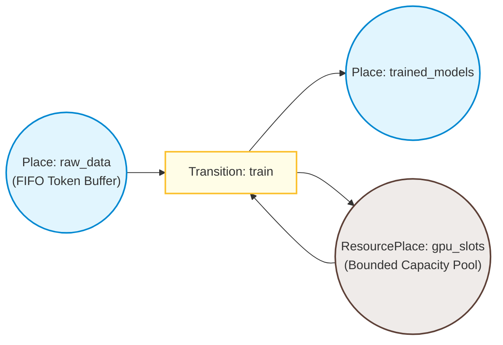

# petriq

[](https://pypi.org/project/petriq/)
[](https://pypi.org/project/petriq/)
[](https://github.com/philgresh/petriq/actions)
[](https://opensource.org/licenses/MIT)

**petriq** is a lightweight, zero-dependency Petri net executor for concurrent Python pipelines.

---

## Motivation

Python has excellent Petri net modeling libraries (like SNAKES for formal analysis and pm4py for process mining) but lacks a lightweight concurrent runtime executor. Developers managing resource-constrained workflows (e.g., GPU slots, API rate limits, database connection pools) often stitch together `threading.Semaphore`, `ThreadPoolExecutor`, and `queue.Queue` by hand—an ad-hoc wiring that is hard to visualize and impossible to analyze for deadlocks. 

`petriq` fills this gap: it lets you model your concurrent pipeline as a Petri net where the engine executes transitions as real concurrent work on thread pools, guarantees resource return on failure, handles rate limits gracefully, and remains under 400 lines of robust, stdlib-only Python code.

---

## Install

Install `petriq` via pip:

```bash
pip install petriq
```

---

## Quickstart

Here is a complete, runnable example showing how to manage a pool of 2 GPU slots across 10 concurrent training jobs:

```python
"""examples/gpu_pipeline.py — GPU slot management with petriq."""

import time
from petriq import InputArc, OutputArc, PetriNet, Place, ResourcePlace, Token, Transition


def train_model(tokens: list[Token]) -> list[Token]:
    # tokens[0] is the raw data token
    data = tokens[0]
    time.sleep(0.5)  # Simulate GPU training work
    data.payload["trained"] = True
    return [data]


# Initialize the Petri Net engine
net = PetriNet(max_workers=4)

# Create places
net.add_place(Place("raw_data"))
net.add_place(Place("trained_models"))
net.add_place(ResourcePlace("gpu_slots", capacity=2))

# Define the training transition
net.add_transition(Transition(
    name="train",
    inputs=[InputArc("raw_data"), InputArc("gpu_slots")],
    outputs=[OutputArc("trained_models"), OutputArc("gpu_slots")],
    action=train_model,
))

# Deposit 10 raw data items
for i in range(10):
    net.deposit("raw_data", Token(payload={"model_id": i}))

# Run the net until all work is complete (or deadline is reached)
net.run(deadline=time.monotonic() + 30)

print(f"Trained: {len(net.places['trained_models'].tokens)}")
print(f"GPU slots returned: {len(net.places['gpu_slots'].tokens)}")
# Output:
# Trained: 10
# GPU slots returned: 2
```

---

## Core Concepts

A Petri net consists of **places** (token containers), **transitions** (processing steps), and **arcs** (directed connections).



- **Tokens**: The data payloads or resource permits passing through the system.
- **Places**: Buffers that hold tokens. Custom place types include:
  - `Place`: Unbounded FIFO queue for data/work items.
  - `ResourcePlace`: Pre-filled bounded pool of resource permits.
  - `PacedResourcePlace`: Like `ResourcePlace`, but returned resource tokens cool down for a specified duration before becoming reusable.
  - `ThresholdPlace`: Holds tokens that are only consumable when the queue depth reaches a configured threshold (great for batch processing).
- **Transitions**: Compute steps. A transition is *enabled* when all input places contain enough tokens and any user-defined guard functions return `True`. When fired, it consumes input tokens, executes an action on the thread pool, and deposits output tokens.
- **Resource Return Invariant**: If a transition raises an exception, the engine automatically catches it, sends the offending data token to the `error_place` (default `"failed"`), and guarantees all resource tokens are returned to their source places. This prevents deadlocks even if network calls or model steps fail.

---

## API Reference

### Token

```python
@dataclass
class Token:
    id: str = ...          # Unique 16-character ID
    payload: dict = ...    # User payload dict
    created_at: float = ... # Monotonic creation time
    is_resource: bool = False # Flag identifying resource tokens
```

### Places

All places are fully thread-safe.

#### `Place(name: str)`
Unbounded FIFO queue.

#### `ResourcePlace(name: str, capacity: int)`
Pre-filled pool with `capacity` resource tokens (each has `is_resource=True`).

#### `PacedResourcePlace(name: str, capacity: int, pacing_secs: float)`
Resource pool where returned tokens are delayed by `pacing_secs` cooldown before being available for consumption again.

#### `ThresholdPlace(name: str, threshold: int)`
FIFO queue where tokens are only eligible for retrieval when the total count is `>= threshold`.

---

### Arcs

#### `InputArc(place: str, count: int = 1, consume_all: bool = False, settle_secs: float = 0.0)`
- `place`: Source place name.
- `count`: Minimum number of tokens required.
- `consume_all`: If `True`, consumes all tokens currently in the place (useful for batching).
- `settle_secs`: If specified, waits until no new tokens have arrived in the place for this duration before allowing retrieval.

#### `OutputArc(place: str, count: int = 1)`
- `place`: Target place name.
- `count`: Number of tokens to deposit.

---

### Transition

```python
@dataclass
class Transition:
    name: str
    inputs: list[InputArc]
    outputs: list[OutputArc]
    action: Callable[[list[Token]], list[Token]]
    guard: Callable[[], bool] | None = None
    priority: int = 10  # Lower numbers fire first
```

---

### PetriNet

```python
class PetriNet:
    def __init__(self, max_workers: int = 4, error_place: str = "failed"): ...
    
    def add_place(self, place: Place) -> None: ...
    def add_transition(self, transition: Transition) -> None: ...
    def deposit(self, place_name: str, token: Token) -> None: ...
    
    def step(self) -> bool: ...          # Fire a single enabled transition, scheduling it asynchronously
    def run(self, deadline: float) -> None: ... # Block and execute enabled transitions until quiescent or deadline
    
    def snapshot(self) -> dict: ...      # Returns a JSON-serializable representation of current markings
    def to_dot(self) -> str: ...         # Generates a Graphviz DOT representation of the Petri net
    def is_quiescent(self) -> bool: ...  # Returns True if no transitions are running, and no transitions can fire
    
    # User-definable callback hooks:
    on_transition_fired: Callable[[str, float], None] | None         # (transition_name, duration_secs)
    on_token_deposited: Callable[[str, Token], None] | None          # (place_name, token)
    on_error: Callable[[str, Exception, Token | None], None] | None # (transition_name, exception, token)
```

---

## Examples

The following example scripts are located in the [examples/](examples/) directory:

- [examples/gpu_pipeline.py](examples/gpu_pipeline.py): Models GPU slot constraints and shows how concurrent jobs are throttled.
- [examples/api_rate_limit.py](examples/api_rate_limit.py): Shows how to use pacing and tokens to enforce external API rate limits.
- [examples/etl_pipeline.py](examples/etl_pipeline.py): Demonstrates a multi-stage ETL pipeline using a `ThresholdPlace` to transform tokens in batches.

---

## FAQ

#### Why not Airflow or Celery?
Airflow and Celery are excellent for heavy, distributed, slow-running DAGs. They are, however, heavyweight, require external message brokers/databases (Redis, Postgres), and add deployment complexity. `petriq` is a zero-dependency in-process threading library designed for fine-grained resource control within a single Python process.

#### Why not asyncio?
The primary target audience (ML/AI pipelines, CPU-bound parsing, legacy database integrations) uses synchronous libraries. Using thread pools allows synchronous code to run concurrently without rewriting blocking calls to async.

#### Can it prevent deadlocks?
Yes, Petri nets are mathematically analyzer-friendly. By expressing your orchestration constraints as explicit place and token structures rather than scattered locks, you can easily reason about and verify deadlock-free properties of your pipeline.

---

## Sandboxing & Pure Evaluation

For safety and mathematical purity, `petriq` supports two ways of expressing guards and arc expressions:
1. **String Expressions**: These are evaluated via `SandboxEvaluator` which performs static AST analysis to enforce a strict allowlist of mathematical and comparison operations. This provides a hermetic sandbox.
2. **Callable Expressions**: Python callable objects (e.g. lambdas or functions) can also be used. While these are executed within a separate thread pool (`cpnx-expr`) and constrained by a timeout (`timeout_secs`), they are **not** I/O-isolated. In-memory closures can capture external modules or mutable states. Full hermetic sandboxing requires using string expressions.

---

## License

This project is licensed under the MIT License - see the [LICENSE](LICENSE) file for details.
