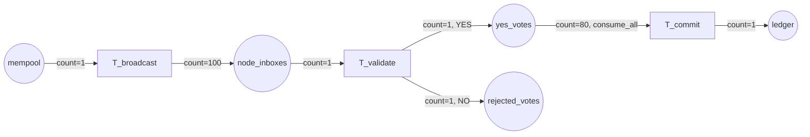

# BFT Consensus Benchmark

A `cpnx` port of the Ripple-style 80%-Unique-Node-List (UNL) Byzantine Fault Tolerant
consensus model onto `cpnx`'s real `ThreadPoolExecutor` engine. The benchmark exists to prove
that `cpnx` is viable for high-throughput concurrent stream processing: it expresses a
massive fan-out, a fractional quorum barrier, and straggler-safe cleanup as Petri-net
*structure* — no user code writes a mutex, a `queue.Full` try/except, or an
`asyncio.gather`. The net's structure alone guarantees a single transaction fans out to 100
validators, a commit can only fire once 80% of them agree, and no vote left over after the
commit can leak into the next round.

The runnable script is `benchmark_consensus.py`. This document explains the model it ports,
the engine mechanics it exercises, and how to run it.

## Contents

- [The academic model](#the-academic-model)
- [The fractional barrier and the straggler problem](#the-fractional-barrier-and-the-straggler-problem)
- [Two execution phases](#two-execution-phases)
- [Diagram](#diagram)
- [Running the benchmark](#running-the-benchmark)
- [Running the tests](#running-the-tests)

## The academic model

The benchmark ports the consensus model from Asare, Nana & Quist-Aphetsi,
[*"Modeling and Simulation of a Blockchain Consensus for IoT Node Data Validation"*](https://thesai.org/Publications/ViewPaper?Volume=13&Issue=12&Code=IJACSA&SerialNo=4)
(IJACSA Vol. 13, No. 12, 2022), which itself models Ripple's consensus protocol. Ripple is a
**permissioned** consensus that operates in rounds using each server's **Unique Node List
(UNL)** — a fixed set of validators the server trusts not to collude. A transaction is
proposed to a server's UNL and only becomes eligible to be appended to the ledger once it
has received **positive validation feedback from at least 80% of that UNL**.

The paper's Byzantine tolerance bound follows from that threshold: the network stays correct
as long as the fraction of Byzantine (faulty or malicious) nodes stays below the failure
bound `f <= (n-1)/5`, i.e. under 20% of the UNL. This benchmark models exactly that
threshold — `N_NODES = 100` validators, `UNL_THRESHOLD = 80` — without asserting any other
numeric result from the paper.

The interesting engineering question this benchmark answers is not "does the 80% rule work"
(the paper already shows that) but "can a general-purpose concurrent CPN engine express the
rule as structure, under real thread contention, without hand-rolled synchronization code."

## The fractional barrier and the straggler problem

This is the centerpiece of the benchmark. Two `cpnx` primitives compose to implement the
80%-UNL rule with zero imperative synchronization:

**The barrier — `ThresholdPlace(threshold=80)`.** `yes_votes` is a `ThresholdPlace`. Unlike a
plain `Place`, it does not report itself as retrievable the moment a single token lands in
it — it only becomes enabled once **at least 80 tokens** have accumulated. `T_commit`'s input
arc, `InputArc("yes_votes", count=UNL_THRESHOLD, consume_all=True)`, therefore cannot fire
until the quorum is met. This *is* the 80%-UNL rule: the barrier is not polled or
counted by any user code, it is declared once, in the net's topology.

**The sweep — `consume_all=True`.** Once the barrier opens, anywhere from 80 to 100 YES
votes may be sitting in `yes_votes` (validators keep voting concurrently right up to the
moment the barrier releases). `consume_all=True` tells the engine to atomically consume
*every* token currently in the place in one firing, not just the 80 the `count` requests.
That single firing folds the whole swept batch (`_commit_action`) into **one** ledger commit
token. Votes 81 through 100 — the "stragglers" that arrive around the same instant the
barrier opens — are swept up in that same atomic firing instead of being left behind to
contaminate the *next* round's quorum count.

Contrast this with the code you would otherwise write by hand: a shared counter guarded by a
lock, a condition variable the commit thread waits on, an explicit "drain the queue" loop
under the same lock to avoid a check-then-act race between "quorum reached" and "collect
outstanding votes" — and you would still need to reason carefully about votes that arrive
between the counter hitting 80 and the drain finishing. Here, the barrier and the sweep are
declared as **net structure** (two constructor arguments), not imperative synchronization
code, and the atomicity guarantee comes from the engine's own firing semantics rather than a
lock you have to get right.

**A priority nuance worth being precise about.** Whether stragglers can exist at all depends
on transition priority, which `build_consensus_net`'s `eager_commit` flag controls:

- **Validate-first priority** (`eager_commit=False`, the default): while any inbox token
  remains unprocessed, `step()` prefers firing `T_validate` over `T_commit`. Under the
  deterministic, single-threaded `drive_to_quiescence` driver this means **every** vote lands
  in `yes_votes` or `rejected_votes` before `T_commit` ever gets a chance to fire — so the
  sweep provably collects zero stragglers (there is nothing left to straggle). This is the
  regime Phase 2 and the test suite use, because it is the regime where "0 stragglers" is not
  just observed but *guaranteed by priority ordering*.
- **Eager-commit priority** (`eager_commit=True`): `T_commit` outranks `T_validate`, so it
  fires the instant the 80-vote barrier is met rather than waiting for the remaining votes to
  land. This keeps the shared `yes_votes` pool small under concurrent load — a `consume_all`
  drain of a deep pool is what motivated the engine's **count-only enablement fast path**
  ([ADR 0005](../../docs/adr/0005-consume-all-count-only-fast-path.md)), which makes the barrier
  probe `O(1)` instead of an `O(N)` full-pool peek. See Phase 1 below.

## Two execution phases

### Phase 1 — concurrent throughput

1,000 transactions are deposited into `mempool` and drained with `net.run()`, swept over
`max_workers` in `(4, 8, 16, 32)` and reported as the **best of 3 trials** per worker count
(min wall time — the standard defence against scheduler noise, which is severe once the worker
count exceeds the machine's physical cores). Each validation (`T_validate`'s action) simulates
~0.5 ms of signature-verification work using `time.sleep`, which releases the GIL — so, unlike
a CPU-bound `time.sleep(0)` no-op, adding worker threads genuinely lets validations overlap in
wall-clock time. This phase uses **eager-commit** priority (see above) to keep the shared
`yes_votes` pool small under 1,000 concurrent transactions.

Documented simplification, stated honestly: because `yes_votes` is a single shared pool, YES
votes from *different* concurrent transactions intermix in it, and each `consume_all` sweep
folds whatever happens to be in the pool at that moment into one commit. As a result,
**`commits` does not equal 1,000** — this phase measures raw engine throughput under fan-out
and fan-in (validations/sec, commits/sec, tokens/sec), not per-transaction consensus
correctness. Exact per-transaction correctness is Phase 2's job.

Expect throughput to rise with worker count and then **saturate — and past the useful
concurrency, regress** — as contention on the engine's single global lock (every worker
funnels its output commit through it) outweighs further overlap. That saturation point is a
property of the machine *and* the executor-based design, reported honestly here rather than
cherry-picked away; it is not a benchmark defect.

### Phase 2 — formal quiescence

Exactly one transaction is driven through `net.drive_to_quiescence()` — the deterministic,
single-threaded logical-clock driver that keeps at most one action in flight at a time. This
produces an exact, reproducible final marking: `ledger = 1`, `yes_votes = 0`, and (at the
benchmark's default 90%-YES rate) around 9 tokens in `rejected_votes`. Because the driver is
deterministic and single-threaded, this is a formal fixed point, not a statistical sample —
the same seed reproduces the same marking every time.

## Diagram

### Rendering the real topology

`cpnx` nets can render their own structure via `PetriNet.to_dot()`. Render the actual
topology this benchmark builds and pipe it through Graphviz:

```bash
python -c "import sys; sys.path.insert(0,'benchmarks/consensus'); from benchmark_consensus import build_consensus_net, always_yes; print(build_consensus_net(always_yes, max_workers=4, seed=1).to_dot())" | dot -Tpng -o consensus.png
```

Captured output of `to_dot()`:

```text
digraph PetriNet {
  rankdir=LR;
  "mempool" [shape=circle]; "node_inboxes" [shape=circle]; "yes_votes" [shape=circle];
  "rejected_votes" [shape=circle]; "ledger" [shape=circle];
  "T_broadcast" [shape=box]; "T_validate" [shape=box]; "T_commit" [shape=box];
  "mempool" -> "T_broadcast" [label="count=1"];
  "T_broadcast" -> "node_inboxes" [label="count=100"];
  "node_inboxes" -> "T_validate" [label="count=1"];
  "T_validate" -> "yes_votes" [label="count=1"];
  "T_validate" -> "rejected_votes" [label="count=1"];
  "yes_votes" -> "T_commit" [label="count=80, consume_all"];
  "T_commit" -> "ledger" [label="count=1"];
}
```

### Equivalent Mermaid diagram



A real API insight worth flagging here: `T_broadcast`'s `OutputArc("node_inboxes",
count=100)` does **not** auto-clone the one consumed token 100 times. `OutputArc(count=N)`
deposits one *action-returned* token per output slot, so the fan-out is produced inside
`_broadcast_action`, which explicitly returns a list of 100 `Token.evolve()`d copies (one per
`node_id`). The `count` on the arc is a contract about how many tokens the action must
return, not a cloning instruction.

## Running the benchmark

```bash
python benchmarks/consensus/benchmark_consensus.py
python benchmarks/consensus/benchmark_consensus.py --n-tx 2000 --workers 8 32 --seed 42
```

CLI flags:

| Flag | Default | Meaning |
| --- | --- | --- |
| `--n-tx` | `1000` | Phase 1 transaction count |
| `--workers` | `4 8 16 32` | Phase 1 `max_workers` sweep |
| `--seed` | `20260726` | RNG / net seed (affects tie-breaking and the vote stream) |

Example output (captured on one machine — absolute numbers are hardware-dependent; read the
shape, not the digits):

```text
⛓️  cpnx BFT consensus benchmark — N_NODES=100, UNL_THRESHOLD=80, seed=20260726

=== Phase 1 — concurrent throughput: 1000 transactions, 90% YES ===
Each validation simulates 0.5 ms of signature-verification work.
Best of 3 trials per worker count (min wall); votes pool across txs by design,
so `commits` is the number of 80-vote batches swept, not the transaction count.

 workers   wall (s)   validations/s    commits/s      tokens/s   speedup
------------------------------------------------------------------------
       4     18.892           5,293         59.5        10,646     1.00x
       8     10.504           9,520        106.7        19,147     1.80x
      16      6.464          15,469        172.6        31,111     2.92x
      32      5.227          19,130        208.7        38,469     3.61x

(Throughput rises with workers as the pool overlaps validation latency, then saturates
 — and past the useful concurrency can regress as contention on the engine's single lock
 outweighs added parallelism. All under real threads with no user-written locks: the net
 fans out (1->100) and fans in (>=80->1) throughout.)

=== Phase 2 — formal quiescence: 1 transaction, deterministic driver ===
  drove to quiescence in 6.1 ms (102 firings, 0 clock ticks)
  firings: {'T_broadcast': 1, 'T_validate': 100, 'T_commit': 1}
  final marking (exact fixed point):
              ledger = 1
      rejected_votes = 9
           yes_votes = 0
        node_inboxes = 0
             mempool = 0
     votes_in_commit = 91
  => 1 tx fanned out to 100 validators; 91 YES votes swept into 1 commit, 9 rejected, 0 stragglers left.
```

Note the shape in the workers sweep above: throughput scales roughly **3.6× from 4 to 32
workers** as the pool overlaps the simulated 0.5 ms of validation latency. It is still rising
at 32 here; push the sweep higher on a machine with more cores and it eventually saturates and
then regresses, as contention on the engine's single global lock (every worker funnels its
output commit through it) outweighs added parallelism. That ceiling is a property of the
machine *and* the executor-based design, reported honestly rather than cherry-picked — a
thread pool does not scale indefinitely just because more threads are added.

Phase 2's marking is deterministic for a given seed: 100 validations fire (`T_broadcast: 1,
T_validate: 100, T_commit: 1`), 91 land YES at the benchmark's 90%-YES rate, all 91 are swept
into the single commit, 9 are rejected, and `yes_votes` ends at exactly 0 — zero stragglers,
guaranteed by the validate-first priority regime described above, not merely observed.

## Running the tests

```bash
pytest tests/test_consensus.py -v
```

The tests drive `build_consensus_net` under `drive_to_quiescence` and assert on the exact
final marking, proving the three CPN-semantic properties this benchmark claims: fan-out to
`N_NODES` validators, the fractional barrier blocking `T_commit` until `UNL_THRESHOLD` votes
accumulate, and straggler-free sweeps under the default priority regime.
